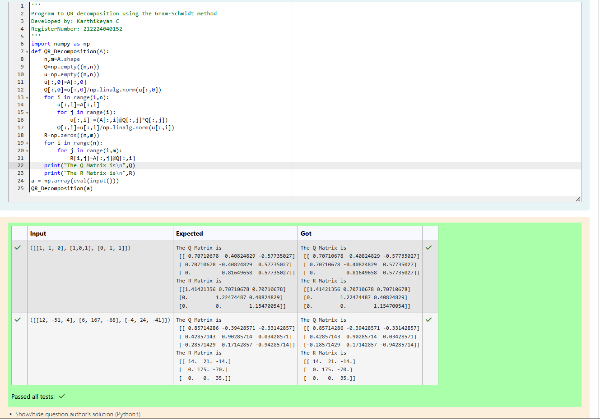

# Algorithm for QR Decomposition
## Aim:
To implement QR decomposition algorithm using the Gram-Schmidt method.
## Equipment’s required:
1.	Hardware – PCs
2.	Anaconda – Python 3.7 Installation / Moodle-Code Runner
## Algorithm:
1.	Intialize the matrix Q and u
2.	The vector u and e is given by

    

    

    

3.	Obtain the Q matrix   
    
4.	Construct the upper triangular matrix R
    
  	
### **Algorithm: QR Decomposition via Gram-Schmidt**

1. **Input** matrix $A$ and determine its shape $(n, m)$.
2. **Initialize** matrices $Q$ and $u$ with empty arrays of shape $(n, n)$.
3. **Set** the first column of $u$ to the first column of $A$.
4. **Normalize** the first column of $u$ to get the first column of $Q$.
5. **For** each column $i = 1$ to $n-1$:
6. → Copy $A[:,i]$ to $u[:,i]$.
7. → Subtract projections of $u[:,i]$ on all previous $Q[:,j]$ vectors.
8. → Normalize $u[:,i]$ to get $Q[:,i]$.
9. **Construct** matrix $R$ as an upper triangular matrix using dot products of $Q$ and $A$.
10. **Display** matrices $Q$ and $R$ as the final QR decomposition.

## Program:
### Gram-Schmidt Method
```
Program to QR decomposition using the Gram-Schmidt method
Developed by: Karthikeyan C
RegisterNumber: 212224040152 
'''
import numpy as np
def QR_Decomposition(A):
    n,m=A.shape
    Q=np.empty((n,n))
    u=np.empty((n,n))
    u[:,0]=A[:,0]
    Q[:,0]=u[:,0]/np.linalg.norm(u[:,0])
    for i in range(1,n):
        u[:,i]=A[:,i]
        for j in range(i):
            u[:,i]-=(A[:,i]@Q[:,j]*Q[:,j])
        Q[:,i]=u[:,i]/np.linalg.norm(u[:,i])
    R=np.zeros((n,m))
    for i in range(n):
        for j in range(i,m):
            R[i,j]=A[:,j]@Q[:,i]
    print("The Q Matrix is\n",Q)
    print("The R Matrix is\n",R)
a = np.array(eval(input()))
QR_Decomposition(a)
```

## Output


## Result
Thus the QR decomposition algorithm using the Gram-Schmidt process is written and verified the result.
